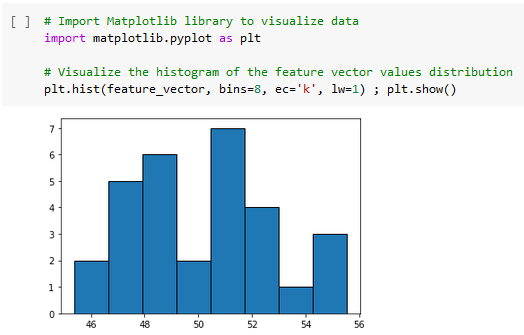
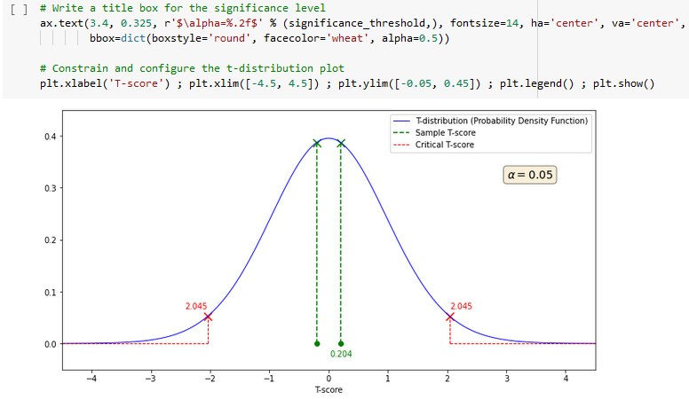

# Hypothesis testing - Student T-test

This project presents a personal walkthrough the hypothesis testing method of the **1-sample Student T-test** with classical Python Data Science libraries. Simple feature vector is generated for comprehension, as a set of randomly generated continuous values, and visualizations are used for better understanding.

Testing whether the controlled generated feature vector have been sampled from a population with an expected known population mean, thanks to a 1-sample 2-tailed Student T-test, is part of the notebook experiment.

